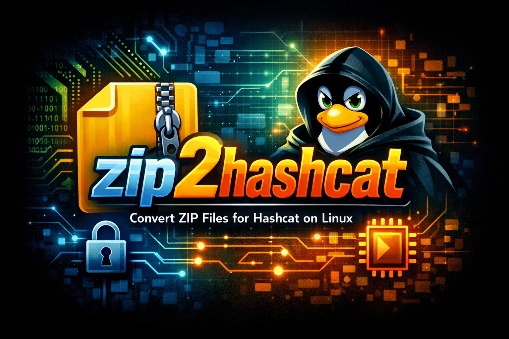

# zip2hashcat

<p align="center">
  
</p>

<p align="center">
  
  
  
</p>

Extract password hashes from ZIP files in native **hashcat-compatible format**. Like `zip2john`, but for hashcat. No John required.

## Table of Contents

* 📥 [Install](#install)
* 💻 [Usage](#usage)
* ⚙️ [Supported Formats](#supported-formats)
* 🔍 [How It Works](#how-it-works)
* ⚡ [zip2hashcat vs zip2john](#zip2hashcat-vs-zip2john)

## Install

zip2hashcat requires **Python 3.10+** and has **zero dependencies** — just download and run:

```
wget https://raw.githubusercontent.com/oliverjueguen/zip2hashcat/main/zip2hashcat.py && chmod +x zip2hashcat.py
```

For a permanent setup, install with pipx:

```
pipx install git+https://github.com/oliverjueguen/zip2hashcat
```

Or with pip:

```
pip install git+https://github.com/oliverjueguen/zip2hashcat
```

## Usage

```
./zip2hashcat.py secret.zip                      # Extract hash + show info and commands
./zip2hashcat.py secret.zip -o hash.txt           # Save hash to file
./zip2hashcat.py secret.zip -q                    # Just the hash (for piping)
./zip2hashcat.py secret.zip --info                # Inspect ZIP encryption details
```

### Sample Output

```
╔════════════════════════════════════════╗
║  zip2hashcat v1.1.0                   ║
╚════════════════════════════════════════╝

  File:         secret.zip
  Entries:      2 total, 2 encrypted
  Encryption:   ZIPCRYPTO
  Hashcat mode: -m 17220 (PKZIP (Compressed Multi-File))
  Files:
    • document.pdf
    • notes.txt

  Hashcat command:
  hashcat -m 17220 -a 0 hash.txt /usr/share/wordlists/rockyou.txt

  With rules:
  hashcat -m 17220 -a 0 hash.txt /usr/share/wordlists/rockyou.txt -r /usr/share/hashcat/rules/best64.rule

  Brute-force (8 chars):
  hashcat -m 17220 -a 3 hash.txt ?a?a?a?a?a?a?a?a
```

### Piping Directly to Hashcat

```bash
./zip2hashcat.py secret.zip -q | hashcat -m 17200 -a 0 - /usr/share/wordlists/rockyou.txt
```

### Command Line Options

```
positional arguments:
  zipfile               Path to password-protected ZIP file(s)

options:
  -o, --output          Save hash to file
  -q, --quiet           Only output the hash (for piping)
  --json                Output results as JSON
  --info                Show ZIP encryption info only
  -V, --version         Print version and exit
  -h, --help            Show help message and exit
```

## Supported Formats

| Encryption | Hashcat Mode | Hash Format | Description |
| --- | --- | --- | --- |
| ZipCrypto (single, compressed) | `-m 17200` | `$pkzip$` | Most common legacy ZIP |
| ZipCrypto (single, stored) | `-m 17210` | `$pkzip$` | Uncompressed entries |
| ZipCrypto (multi, compressed) | `-m 17220` | `$pkzip$` | Multiple files, all deflated |
| ZipCrypto (mixed multi) | `-m 17225` | `$pkzip$` | Mix of compressed + stored |
| WinZip AES-128 | `-m 13600` | `$zip2$` | Modern encryption |
| WinZip AES-192 | `-m 13600` | `$zip2$` | Modern encryption |
| WinZip AES-256 | `-m 13600` | `$zip2$` | Modern encryption (most common) |

The correct hashcat mode is **auto-detected** based on the ZIP's encryption method, compression type, and number of entries.

## How It Works

zip2hashcat parses the ZIP binary structure directly (local headers, central directory, AES extra fields) to extract the cryptographic material hashcat needs:

- **ZipCrypto**: Extracts the 12-byte encryption header + encrypted data + CRC32 checksum → `$pkzip$` format
- **WinZip AES**: Extracts salt + password verification bytes + authentication code → `$zip2$` format

Uses the current `$pkzip$` format (not the legacy `$pkzip2$` which had [checksum bugs](https://github.com/hashcat/hashcat/issues/2719)).

## zip2hashcat vs zip2john

| | zip2john | zip2hashcat |
| --- | --- | --- |
| Dependency | Requires John the Ripper | **Standalone** (pure Python) |
| Output format | John format (needs `cut -d ':' -f 2`) | **hashcat-ready** |
| Mode detection | Manual | **Automatic** |
| Hash format | `$pkzip$` / `$pkzip2$` (older versions) | `$pkzip$` (current) |
| Ready-to-use commands | ❌ | ✅ |
| AES support | Via zip2john | **Native** |
| Install | Full John suite | **Single file wget** |

## Author

Made by [@oliverjueguen](https://github.com/oliverjueguen)

## License

MIT
